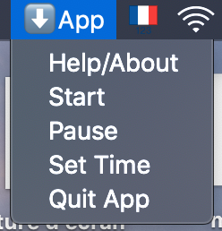

# Download Single-Use Files!

everytime the user downloads a file to the "Downloads" directory, it will ask through a pop-up window if they want to make this download a single-use file. A single-use file would be a file that is opened right after the download and deleted right after that (or some amount of time after that, chosen by the user in the menu). The point of this is to automatically get rid of all the files we download to have a quick look at them and never use again. The user will also be able to keep the downloaded file and move it to another folder.

YOUR "DOWNLOADS" DIRECTORY WILL FOREVER BE "CLEAN"!

 - This app only runs on macOS
 - The UI is in the Mac Menu Bar at the top of the screen
 - A standalone app is provided in the zip file above but if you don't trust me, you can make it yourself from the code with py2app
 - You can test it by running the scripts using (with python3 or more recent): python main.py
 - As it is, it only works for files downloaded from chrome and safari but can be easily modified to cover more browsers (comments in the code can help know what to change)

  

- If you click yes, the file will open and it will be single-use
- If you click no, the file won't open but will remain in the "Downloads" directory
- If you click no & move, you can choose which directory you want to put your file in
