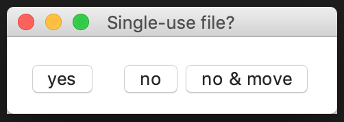

# Download Single Use Files!

When this python script is running, everytime the user downloads a file to the "Downloads" directory, it will ask through a pop-up window if they want to make this download a single use file. A single use file would be a file that is opened right after the download and deleted after that. So once closed the file will never be accessible again. The point of this automatically get rid of all the files that we download to just have a quick look at them and never use again. 

YOUR "DOWNLOADS" DIRECTORY WILL FOREVER BE "CLEAN"!

 - This script will only run on macOS
 - It should be run with python3 or more recent version
 - As it is, it only works for files downloaded from chrome and safari but can be easily modified to cover more browsers (comments in the code can help know what to change)

- If you click yes, the file will open and it will be single use. 
- If you click no, the file won't open but will remain in the "Downloads" directory
